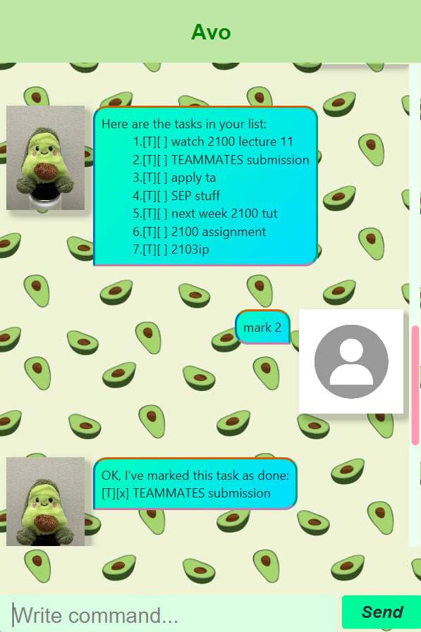

# Avo - User Guide

## Introduction
AddressBook Level 3 (AB3) is for those who **prefer to use a desktop app for managing contacts**. More importantly, AB3 is **optimized for users who prefer to work with a Command Line Interface (CLI)** while still having the benefits of a Graphical User Interface (GUI). If you can type fast, AB3 can get your contact management tasks done faster than traditional GUI apps.

---

## Quick start

1. Ensure you have Java `17` or above installed.
2. Download the latest `Avo.jar` from the [releases](https://github.com/thomas5564/ip/releases).
3. Copy the file to the folder you want to use as the home folder.
4. Run the file using java -jar Avo.jar . A GUI similar to below should appear:

5. Some example commands you can try:
    * `list` — lists all persons.
    * `todo homework` — adds a to-do task.
    * `delete 3` — deletes the 3rd person shown in the current list.
    * `clear` — deletes all persons.
    * `bye` — exits the app.

6. Refer to the [Features](#features) below for details.

---

## Commands

> Words in `UPPER_CASE` are the parameters to be supplied by the user.  
> Parameters must be in the correct format.  
> Dates should be written in `yyyy-mm-dd`.

---

### Exiting the program: `bye`
Exits Avo.  
**Format:**  
>bye

---

### Listing all tasks: `list`
Shows all tasks in your list.  
**Format:**  
>list

---

### Listing this week's tasks: `listw`
Shows only the tasks that were created this week.  
**Format:**  
>listw

---

### Adding a to-do: `todo`
Adds a basic to-do task.  
**Format:**  
>todo DESCRIPTION

**Example:**  
>todo read book

---

### Adding a deadline: `deadline`
Adds a deadline task with a due date.  
**Format:**  
>deadline DESCRIPTION /by DATE

**Example:**  
>deadline submit report /by 2025-09-15

---

### Adding an event: `event`
Adds an event task with a start and end date.  
**Format:**  
>event DESCRIPTION /from START_DATE /to END_DATE

**Example:**  
>event project sprint /from 2025-09-10 /to 2025-09-12

---

### Marking a task as done: `mark`
Marks the specified task as done.  
**Format:**  
>mark INDEX

**Example:**  
>mark 2

---

### Unmarking a task: `unmark`
Marks the specified task as not done.  
**Format:**  
>unmark INDEX

**Example:**  
>unmark 2

---

### Deleting a task: `delete`
Deletes the specified task from the list.  
**Format:**  
>delete INDEX

**Example:**  
>delete 3

---

### Finding tasks: `find`
Finds tasks that contain the specified keyword in their description.  
**Format:**  
>find KEYWORD

**Example:**  
>find report
---

### Viewing statistics: `stat`
Shows weekly statistics about your tasks (tasks done, finish rate).  
**Format:**  
>stat

---

## Command Summary

| Action       | Format                                  | Example                                                |
|--------------|-----------------------------------------|--------------------------------------------------------|
| **Bye**      | `bye`                                   | `bye`                                                  |
| **List**     | `list`                                  | `list`                                                 |
| **ListW**    | `listw`                                 | `listw`                                                |
| **Todo**     | `todo DESCRIPTION`                      | `todo read book`                                       |
| **Deadline** | `deadline DESCRIPTION /by DATE`         | `deadline submit report /by 2025-09-15`                |
| **Event**    | `event DESCRIPTION /from START /to END` | `event project sprint /from 2025-09-10 /to 2025-09-12` |
| **Mark**     | `mark INDEX`                            | `mark 2`                                               |
| **Unmark**   | `unmark INDEX`                          | `unmark 2`                                             |
| **Delete**   | `delete INDEX`                          | `delete 3`                                             |
| **Find**     | `find KEYWORD`                          | `find report`                                          |
| **Stat**     | `stat`                                  | `stat`                                                 |

---
---

## Keyboard Commands

In addition to typing commands, you can also use the following keyboard commands:

- **ALT** — Toggle between **CLI mode** and **GUI mode**.
- **F2** — Toggle the **Statistics Page** on and off.

These shortcuts let you quickly switch views without typing commands.
